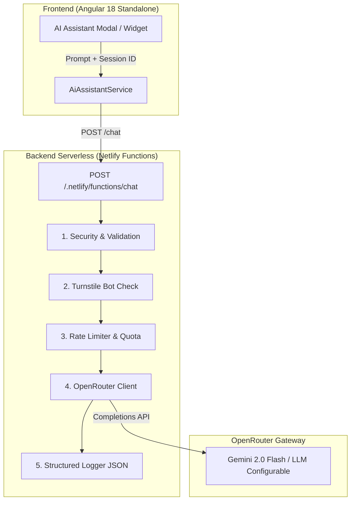

# BravoBytes - Personal Portfolio & AI Assistant

Sitio web y portafolio profesional de **Nicolás Bravo** (Analista Programador / Desarrollador Full-Stack), desarrollado con **Angular 18 SSR** y potenciado con una arquitectura serverless en **Netlify Functions** para el asistente virtual inteligente **BravoBot AI (V1)**.

---

## 🤖 AI Portfolio Assistant (V1 Experimental)

El asistente virtual permite a reclutadores y visitantes consultar interactivamente acerca del perfil profesional, experiencia, stack tecnológico, proyectos y formas de contacto de Nicolás Bravo.

No es un chatbot genérico: está construido bajo principios estrictos de **seguridad server-side, control de costes/tokens, rate limiting y observabilidad estructurada**.



---

### 🛡️ Decisiones Técnicas y Arquitectura de Seguridad

1. **Aislamiento de Secretos**: 
   * La API Key de OpenRouter y el System Prompt nunca se exponen al cliente, HTML ni bundles generados por Angular. Residen exclusivamente en variables de entorno del backend serverless.
2. **Validación Server-Side Robusta**:
   * Restricción estricta al método `POST` y `Content-Type: application/json`.
   * Límite de payload (máx 5 KB) y longitud de pregunta (máx 300 caracteres).
   * Sanitización de caracteres nulos, bytes de control y rechazo de prompts vacíos.
3. **Control de Costes y Tokenomics**:
   * Salida máxima acotada (`max_tokens: 250`) y temperatura controlada (`0.3`) para respuestas precisas y económicas.
   * Timeouts estrictos (12 segundos con `AbortController`).
   * Cuotas por sesión (6 preguntas por visitante) y limitación de consultas en ventana deslizante (10 reqs / 10 min por IP).
4. **Protección Anti-Bot (Cloudflare Turnstile)**:
   * Verificación del token en servidor contra `https://challenges.cloudflare.com/turnstile/v0/siteverify`.
   * Bypass seguro y configurable en desarrollo local si no se provee la variable de entorno.
5. **Observabilidad y Privacidad**:
   * Cada solicitud genera un `requestId` único (UUID v4).
   * Logging estructurado en formato JSON con métricas clave: latencia (`durationMs`), status HTTP, `inputLength`, `outputLength`, tokens consumidos (`promptTokens`, `completionTokens`), hashes anonimizados de IP/sesión y categorización de preguntas (`technologies`, `projects`, `contact`, etc.).
   * **Privacidad**: No se almacenan conversaciones completas en base de datos. Los logs solo registran un `inputPreview` truncado a 100 caracteres con redacción automática de correos, teléfonos y secretos.

---

### ⚙️ Variables de Entorno

Crea un archivo `.env` en la raíz (ignorado por Git) basándote en `.env.example`:

```bash
# OpenRouter Gateway
OPENROUTER_API_KEY=tu_api_key_de_openrouter
OPENROUTER_MODEL=google/gemini-2.0-flash-001

# System Prompt Personalizado (Opcional - usa el prompt interno por defecto)
BRAVOBYTES_SYSTEM_PROMPT=

# Cloudflare Turnstile (Opcional para desarrollo local)
TURNSTILE_SECRET_KEY=
TURNSTILE_ENABLED=false
```

---

### 🚀 Desarrollo Local y Build

#### 1. Instalar Dependencias
```bash
npm install
```

#### 2. Servidor de Desarrollo Angular
```bash
npm start
# o
ng serve
```
Navega a `http://localhost:4200/`.

#### 3. Build de Producción (con SSR y Prerender)
```bash
npm run build
```

---

### 🛣️ Roadmap / Evolución Futura
- [x] **V1**: Asistente serverless stateless, OpenRouter gateway, control de tokens, rate limiting y observabilidad estructurada.
- [ ] **V2**: Almacenamiento persistente distribuido para Rate Limiting con Upstash / Redis.
- [ ] **V3**: Integración RAG con base vectorial para búsqueda semántica profunda en artículos de blog y código de proyectos.
